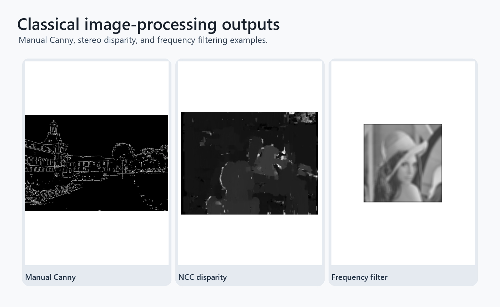

# Classical Image Processing Algorithms

Manual implementations of core computer vision routines: FFT magnitude/phase reconstruction, spatial vs frequency-domain filtering, stereo disparity via normalized cross-correlation, and a Canny edge detector pipeline.

## Highlights

- Reconstructs images from swapped FFT magnitude and phase components.
- Compares spatial convolution with frequency-domain filtering.
- Computes stereo disparity maps with manual NCC and compares against OpenCV StereoBM.
- Implements Gaussian smoothing, gradients, non-maximum suppression, double thresholding, and hysteresis for Canny-style edge detection.

## Repository Layout

- `fft_phase_reconstruction.py` - Fourier magnitude/phase experiments.
- `spatial_frequency_filtering.py` - manual convolution and FFT-based filtering.
- `stereo_ncc_disparity.py` - stereo matching with normalized cross-correlation.
- `canny_from_scratch.py` - edge detection pipeline from first principles.
- `data/` - sample images and generated comparison outputs.

## Setup

```bash
pip install -r requirements.txt
```

## Run

```bash
python fft_phase_reconstruction.py
python spatial_frequency_filtering.py
python stereo_ncc_disparity.py
python canny_from_scratch.py
```

## Result screenshots



Representative outputs from manual Canny, stereo NCC, and frequency-domain filtering.


## What this demonstrates

- Core image-processing algorithms implemented directly rather than hidden behind one-line library calls.
- Comparison artifacts that make intermediate behavior visible.
- Breadth across Fourier filtering, stereo matching, and edge detection.


## Limitations and next steps

- The implementations prioritize clarity over real-time performance.
- Parameter choices are tuned for the included sample images.
- Next steps: add benchmark timings and a small pytest suite for numerical regression checks.

